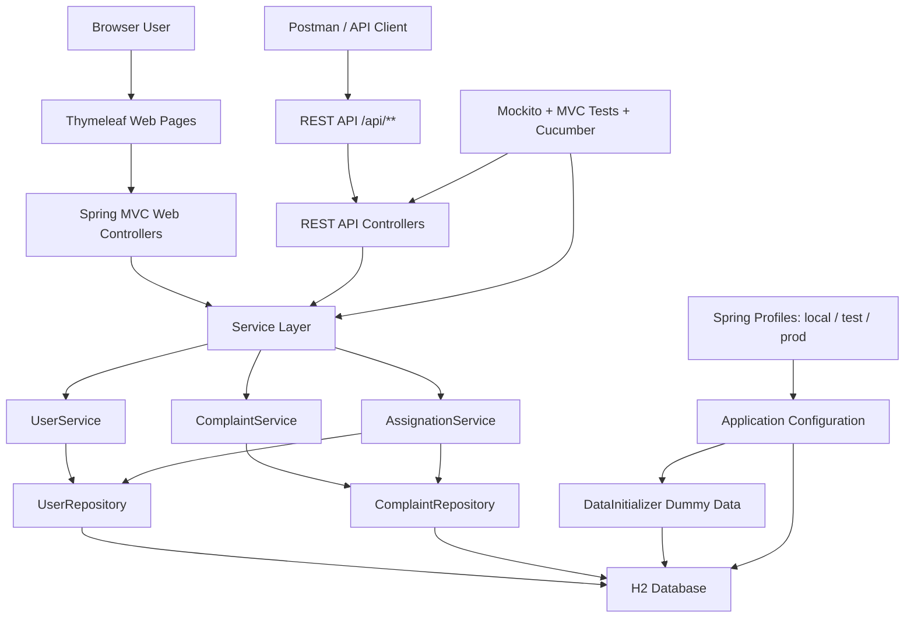

# Complaint Management System

Complaint Management System is a Spring Boot 4 web application built with Java 17, Maven, Thymeleaf, Spring Data JPA, Bean Validation, H2, Mockito, and Cucumber. It supports complaint creation, assignment, status tracking, customer feedback, employee remarks, reporting, manual API testing through Postman, and automated test coverage.

## Architecture

The application follows a layered Spring MVC architecture.



```text
Browser / Postman
      |
      v
Controllers
  - Thymeleaf web controllers
  - JSON REST API controllers under /api
      |
      v
Services
  - UserService
  - ComplaintService
  - AssignationService
      |
      v
Repositories
  - UserRepository
  - ComplaintRepository
      |
      v
H2 In-Memory Database
```

## Main Components

Model layer:
- `User`: stores user profile, login credentials, role, and employee availability.
- `Complaint`: stores complaint details, status, comments, feedback, customer, and assigned employee.
- `Date`: helper class for date information.
- `Role`: `ADMIN`, `CUSTOMER`, `EMPLOYEE`.
- `ComplaintStatus`: `PENDING`, `IN_PROGRESS`, `COMPLETED`.

Repository layer:
- `UserRepository`: database access for users, roles, email lookup, and available employees.
- `ComplaintRepository`: database access for complaints, reports, customer complaints, employee complaints, and date/status filters.

Service layer:
- `UserService`: registration, login, password reset, user lookup, customer and employee lookup.
- `ComplaintService`: add, update, delete, load, and search complaint records.
- `AssignationService`: finds available employees and assigns complaints.

Controller layer:
- Web controllers return Thymeleaf pages for login, admin, customer, employee, assignment, and reports.
- API controllers under `/api/**` return JSON responses for Postman and automated endpoint testing.

View layer:
- Thymeleaf templates are stored in `src/main/resources/templates`.
- CSS is stored in `src/main/resources/static/css/style.css`.

Configuration:
- Base configuration is stored in `src/main/resources/application.properties`.
- Profile-specific configuration is stored in `application-local.properties`, `application-test.properties`, and `application-prod.properties`.
- Dummy data is inserted by `DataInitializer` when `cms.seed.enabled=true`.

## Features

- Login by role: Admin, Customer, Employee.
- Customer registration.
- Password reset flow.
- Admin complaint add, update, delete, view, and status update.
- Complaint assignment to available employees.
- Employee assigned complaint view, status update, and remarks.
- Customer complaint registration, view, comments, and feedback.
- Reports by pending status, completed status, date range, and user.
- JSON REST API for Postman testing.
- Mockito unit tests, Spring MVC integration tests, and Cucumber end-to-end tests.

## Requirements

- Java 17 or higher.
- Maven.

Check versions:

```powershell
java -version
mvn -version
```

## How To Run

From the project root:

```powershell
mvn spring-boot:run
```

This uses the default `local` profile.

Open the application:

```text
http://localhost:8080
```

## Run Profiles

The project has three Spring profiles:

| Profile | Purpose | Database | Seed Data |
| --- | --- | --- | --- |
| `local` | Developer/local manual testing | H2 in-memory `cmsdb` | Enabled |
| `test` | Automated tests | H2 in-memory `cms_test_db` | Enabled |
| `prod` | Production-like runtime | File H2 by default, configurable by env vars | Disabled |

Default profile:

```text
local
```

Run with local profile:

```powershell
mvn spring-boot:run -Dspring-boot.run.profiles=local
```

Run with test profile:

```powershell
mvn spring-boot:run -Dspring-boot.run.profiles=test
```

Run with prod profile:

```powershell
mvn spring-boot:run -Dspring-boot.run.profiles=prod
```

Run packaged jar with a profile:

```powershell
java -jar target/cms-0.0.1-SNAPSHOT.jar --spring.profiles.active=prod
```

Production profile environment variables:

```text
SERVER_PORT
DATABASE_URL
DATABASE_DRIVER
DATABASE_USERNAME
DATABASE_PASSWORD
```

Enable seed data manually in any profile:

```powershell
mvn spring-boot:run -Dspring-boot.run.arguments="--cms.seed.enabled=true"
```

H2 console:

```text
http://localhost:8080/h2-console
```

H2 settings:

```text
JDBC URL: jdbc:h2:mem:cmsdb
Username: sa
Password: leave blank
```

## Demo Users

| Role | Email | Password |
| --- | --- | --- |
| Admin | admin@cms.com | admin123 |
| Customer | customer@cms.com | customer123 |
| Employee | employee@cms.com | employee123 |

Additional seeded users are available in local and test profiles:

| Role | Email | Password |
| --- | --- | --- |
| Customer | priya@cms.com | customer123 |
| Customer | rahul@cms.com | customer123 |
| Customer | ananya@cms.com | customer123 |
| Employee | employee2@cms.com | employee123 |
| Employee | amit.employee@cms.com | employee123 |
| Employee | sneha.employee@cms.com | employee123 |

Stable seeded IDs:

| Record | ID |
| --- | --- |
| Admin User | `1` |
| Customer User | `2` |
| Employee One | `3` |
| Employee Two | `4` |

## Dummy H2 Data

The local and test profiles create dummy data automatically:

- 1 admin user.
- 4 customer users.
- 4 employee users.
- 10 complaints.
- Complaints across `PENDING`, `IN_PROGRESS`, and `COMPLETED`.
- Assigned and unassigned complaints.
- Customer comments.
- Employee remarks.
- Customer feedback.
- Complaint dates from January 2026 through June 2026 for date-range report testing.

The prod profile disables seed data by default:

```text
cms.seed.enabled=false
```

## Postman Testing

Import this collection into Postman:

```text
postman/CMS.postman_collection.json
```

Steps:

1. Start the app with `mvn spring-boot:run`.
2. Open Postman.
3. Import `postman/CMS.postman_collection.json`.
4. Confirm collection variable `baseUrl` is `http://localhost:8080`.
5. Run requests from top to bottom so generated IDs are saved into collection variables.

The collection covers:
- Login.
- Register customer.
- Reset password.
- Create, view, update, delete complaints.
- Update complaint status.
- Update customer comments.
- Give feedback.
- View available employees.
- Assign complaint.
- Employee complaint view and update.
- Reports by status, date range, and user.

## How To Test

Run all tests:

```powershell
mvn test
```

Tests use the `test` profile through `@ActiveProfiles("test")`.

This runs:
- Mockito unit tests for services and models.
- Spring MVC integration tests for web and API endpoints.
- Cucumber end-to-end tests for the API workflow.

Current verified test summary:

```text
Tests run: 30
Failures: 0
Errors: 0
Cucumber: 2 scenarios, 25 steps passed
```

Run a specific test class:

```powershell
mvn -Dtest=UserServiceTest test
mvn -Dtest=ApiEndpointTest test
mvn -Dtest=CucumberTest test
```

View test reports:

```text
target/surefire-reports
```

View JaCoCo coverage report:

```text
target/site/jacoco/index.html
```

Current verified coverage:

```text
Line coverage: 86.65%
Method coverage: 96.73%
```

## Build Package

Create the executable jar:

```powershell
mvn clean package
```

Run the jar:

```powershell
java -jar target/cms-0.0.1-SNAPSHOT.jar
```
